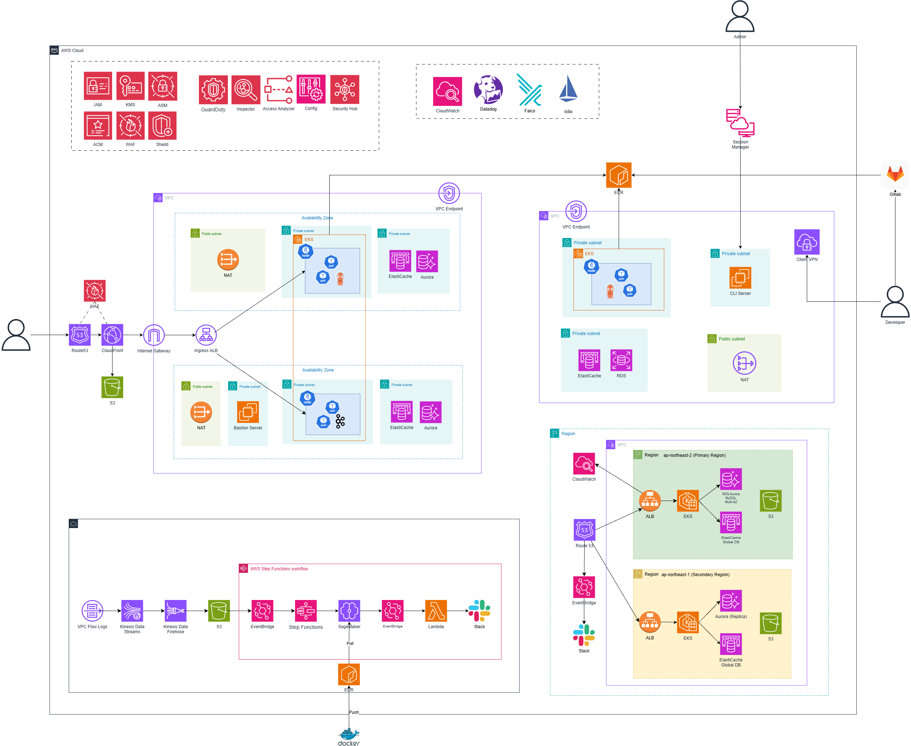

# OliveYoung 세일 이벤트 대응 인프라


> 담당 파트: 네트워크(VPC) / 컨테이너(EKS, Karpenter, Keda)

---

## 1. 프로젝트 개요 & 인프라 핵심 성과

### 프로젝트 배경

저희가 선택한 서비스는 올리브영의 대규모 세일 이벤트, '올영세일'입니다. 올리브영은 연 4회 이상 정기 세일을 진행하는데, 세일 시작 시점에 대량의 트래픽이 단시간에 집중되는 특성이 있습니다. 이때 트래픽을 감당하지 못하면 아래와 같은 서비스 지연·접속 장애로 이어져 매출에 직접적인 타격을 입습니다.


이러한 문제 인식을 바탕으로 **"올영세일 대응 AWS 클라우드 인프라 구축"**을 프로젝트 목표로 삼았습니다.

### 담당 범위

올리브영 정기 세일의 순간 대량 트래픽에 대응하는 AWS EKS 기반 인프라 중, **VPC 네트워크 설계와 EKS 클러스터/노드 오토스케일링(Karpenter, KEDA)** 파트를 담당했습니다.

---

## 2. 시스템 아키텍처 구조도 & 트래픽 흐름



사용자 요청은 Route53 → CloudFront/S3(프론트엔드 정적 호스팅) → WAF → ALB를 거쳐 VPC 내부로 유입됩니다. VPC는 ap-northeast-2 리전에 2개 AZ(2a/2c)로 이중화되어 있으며, Public/Private App/Private Data 3-tier 서브넷으로 분리했습니다.

- **Public Subnet**: ALB, NAT Gateway 배치 — 인터넷 인그레스와 아웃바운드 경로만 노출
- **Private App Subnet**: EKS 워커 노드 배치. Karpenter가 EC2NodeClass/NodePool 설정에 따라 트래픽 양에 맞춰 노드를 자동 프로비저닝하며, ALB는 target-type: ip로 Pod에 직접 라우팅
- **Private Data Subnet**: Aurora MySQL(Multi-AZ), ElastiCache Redis 배치 — App 계층과 물리적으로 분리해 데이터 계층 보안 경계 확보
- AZ별로 NAT Gateway를 이중화해 한쪽 AZ 장애 시에도 아웃바운드 경로 유지

---

## 3. IaC 디렉토리 구조

```
terraform/
├── main.tf                 # 전체 모듈 오케스트레이션
├── karpenter_iam.tf         # Karpenter IAM (OIDC Trust, Node KMS)
├── variables.tf / outputs.tf / terraform.tfvars
└── modules/
    ├── vpc/                 # VPC, 3-tier 서브넷, NAT, 라우팅
    ├── security-groups/     # 7개 SG
    ├── eks/                 # 클러스터 + OIDC
    ├── ecr/                 # 컨테이너 이미지 레지스트리
    ├── rds/                 # Aurora MySQL Multi-AZ
    ├── elasticache/         # Redis
    ├── alb-controller/      # ALB Controller Helm 릴리스
    ├── argocd/              # ArgoCD Helm 릴리스
    ├── cli/                 # SSM 기반 Bastion
    ├── secrets/             # Secrets Manager
    ├── waf/                 # WAF
    ├── kms/                 # KMS
    ├── s3/                  # 프론트엔드 정적 호스팅
    ├── route53/             # DNS
    ├── acm/                 # SSL 인증서
    └── cloudfront/          # CDN
```

---

## 4. 핵심 설계 사항

### [k8s] Karpenter + KEDA 아키텍처 설계

올영세일은 이벤트 시작 시각이 사전 공지되는 구조라 트래픽 폭주 타이밍은 예측 가능하지만, 규모는 순간적입니다. CPU 기반 HPA는 파드 내부 부하가 오른 뒤에야 반응해 세일 시작 직후 스파이크 초입을 방어하지 못하고, Pod 수를 늘려도 실행할 Node가 없으면 Pending 상태로 대기하는 문제가 있었습니다. 이 두 가지를 풀기 위해 Pod 레벨 스케일링과 Node 레벨 스케일링을 분리해서 설계했습니다.

KEDA와 Karpenter의 역할을 분리해 설계했습니다.

| 컴포넌트 | 역할 |
|---|---|
| KEDA | 몇 개의 Pod가 필요한가 — 외부 메트릭 기반 이벤트 드리븐 스케일링 |
| Karpenter | 그 Pod를 어디서 실행할 것인가 — Pending Pod 요구사항 분석 후 노드 자동 선택·프로비저닝 |

CPU/Memory 기반 HPA는 팀 내에서 논의됐지만 의도적으로 배제했습니다. 사후 반응형이라 스파이크 초입을 방어하지 못하는 데다, KEDA와 동일 Deployment를 동시 제어하면 충돌할 가능성이 있었습니다. 팀원이 추가한 `Deployment.spec.replicas` 필드를 직접 제거해 KEDA 단독 제어 원칙을 지켰습니다.

Karpenter는 NodePool을 통해 c/m/r 인스턴스 패밀리·6세대 이상·xlarge~8xlarge 범위에서 Spot과 On-Demand를 혼합 선택하도록 구성했고, Node Group을 사전에 정의하지 않고 Pending Pod의 요구사항을 실시간으로 분석해 인스턴스를 선택하도록 했습니다. 세일 시간대에는 disruption budget을 0으로 설정해, 트래픽이 몰리는 순간 노드가 통합·교체되며 파드가 흔들리는 것을 방지했습니다.

최종적으로 구성한 KEDA 트리거는 다음과 같습니다.

| 트리거 | 역할 | 선택 이유 |
|---|---|---|
| Datadog RPS | 실시간 외부 요청량 | 트래픽의 가장 직접적인 선행 지표 |
| Kafka Consumer Lag | 처리 대기 메시지 적체 | 백엔드 처리 부하 지표 |
| Cron | 세일 전 Pod 사전 확보 | 예측 가능한 시간대 선제 대응, Karpenter 노드 준비 시간 확보 |

단일 ScaledObject로 트리거를 통합 관리하고, KEDA 스케일아웃 → Pending Pod 발생 → Karpenter 노드 자동 프로비저닝으로 이어지는 2-레이어 구조를 구현했습니다. 150,000 VU 부하테스트에서 Pod 100개·노드 26개까지 자동 확장되었고, 서비스 중단·OOMKilled 없이 트래픽을 처리했습니다.
