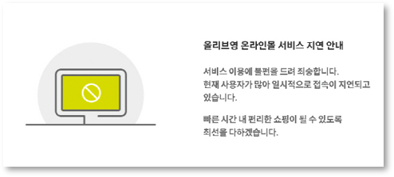

# OliveYoung 세일 이벤트 대응 인프라


> 담당 파트: 네트워크(VPC) / 컨테이너(EKS, Karpenter)

---

## 1. 프로젝트 개요 & 인프라 핵심 성과

### 프로젝트 배경

저희가 선택한 서비스는 올리브영의 대규모 세일 이벤트, '올영세일'입니다. 올리브영은 연 4회 이상 정기 세일을 진행하는데, 세일 시작 시점에 대량의 트래픽이 단시간에 집중되는 특성이 있습니다. 이 순간 트래픽을 감당하지 못하면 아래와 같은 서비스 지연·접속 장애로 이어져 매출에 직접적인 타격을 입습니다.



이러한 문제 인식을 바탕으로 **"올영세일 대응 AWS 클라우드 인프라 구축"**을 프로젝트 목표로 삼았습니다.

### 담당 범위

올리브영 정기 세일의 순간 대량 트래픽에 대응하는 AWS EKS 기반 인프라 중, **VPC 네트워크 설계와 EKS 클러스터/노드 오토스케일링(Karpenter)** 파트를 담당했습니다.

### 핵심 인프라 성과

| 지표 | 결과 |
|---|---|
| 최대 동시 접속자 | 150,000 VU (k6 부하테스트) |
| 피크 RPS | 56,300 hits/s (Datadog 실측) |
| P99 Latency | 180ms 이하 |
| 서비스 중단 / OOMKilled | 0건 |
| 최대 노드 | 26개 (Karpenter Spot/온디맨드 혼합 자동 프로비저닝) |
| IaC 적용률 | Terraform 모듈 16개, 전 인프라 코드화 |

---

## 2. 시스템 아키텍처 구조도 & 트래픽 흐름

```
사용자
  │ HTTPS
  ▼
Route53 → CloudFront ── S3 (프론트엔드 정적 호스팅)
  │
  ▼
WAF → ALB (internet-facing, ACM 인증서 종단)
  │  target-type: ip / health-check: /actuator/health:8080
  ▼
VPC (ap-northeast-2, 2-AZ: 2a/2c)
  ├─ Public Subnet (10.0.101~102.0/24)   : ALB, NAT GW
  ├─ Private App Subnet (10.0.1~2.0/24)  : EKS 워커 노드 (Karpenter 프로비저닝)
  │     └─ EC2NodeClass(AL2023, amd64) + NodePool(c/m/r 6세대+, xlarge~8xlarge)
  └─ Private Data Subnet (10.0.11~12.0/24) : Aurora MySQL(Multi-AZ), ElastiCache Redis
```

- Public/App/Data 서브넷을 3-tier로 분리 (AZ당 서브넷 3개 × 2AZ = 6서브넷)
- Data 서브넷은 App 서브넷과 물리적으로 분리해 보안 경계 확보
- NAT Gateway는 AZ별 1개씩 이중화

---

## 3. 기술 스택 및 채택 이유

| 영역 | 기술 | 채택 이유 |
|---|---|---|
| IaC | Terraform (16개 모듈) | VPC/EKS/RDS 등 전 인프라를 모듈 단위로 분리해 환경 재현성과 상태 관리 일관성 확보 |
| 네트워크 | VPC 3-tier 서브넷 (Public/App/Data) + AZ 이중화 | 워커 노드와 데이터 계층을 물리적으로 분리해 장애 격리 및 보안 경계 강화 |
| 컨테이너 오케스트레이션 | EKS v1.30 | 관리형 컨트롤 플레인으로 운영 부담을 줄이고 대규모 트래픽에 필요한 확장성 확보 |
| 노드 프로비저닝 | Karpenter (v1.0.1) | Managed Node Group 대비 인스턴스 패밀리 자동 선택 + Spot/On-Demand 혼합으로 비용 최적화. 세일 피크 시간대엔 disruption budget으로 노드 교체 0건 강제 |
| 트래픽 인입 | AWS Load Balancer Controller (ALB Ingress) | target-type: ip로 kube-proxy 홉을 생략, Pod에 직접 라우팅해 지연 감소 |
| GitOps 배포 | ArgoCD | Git을 단일 진실 소스로 삼아 selfHeal/prune으로 클러스터 상태와 매니페스트 상태를 자동 동기화 |

---

## 4. IaC 디렉토리 구조

```
terraform/
├── main.tf                 # 전체 모듈 오케스트레이션
├── karpenter_iam.tf         # Karpenter IAM (OIDC Trust, Node KMS)
├── variables.tf / outputs.tf / terraform.tfvars
└── modules/
    ├── vpc/                 # VPC, 3-tier 서브넷, NAT, 라우팅
    ├── security-groups/     # 7개 SG
    ├── eks/                 # 클러스터 + OIDC
    ├── ecr/                 # 컨테이너 이미지 레지스트리
    ├── rds/                 # Aurora MySQL Multi-AZ
    ├── elasticache/         # Redis
    ├── alb-controller/      # ALB Controller Helm 릴리스
    ├── argocd/              # ArgoCD Helm 릴리스
    ├── cli/                 # SSM 기반 Bastion
    ├── secrets/             # Secrets Manager
    ├── waf/                 # WAF
    ├── kms/                 # KMS
    ├── s3/                  # 프론트엔드 정적 호스팅
    ├── route53/             # DNS
    ├── acm/                 # SSL 인증서
    └── cloudfront/          # CDN
```

---

## 5. 파이프라인 흐름

```
git push main
  │
  ├─ [1] test             Gradle JUnit (allow_failure)
  ├─ [2] build            Docker build → ECR push (commit SHA 태그)
  ├─ [3] trivy-scan       CVE 취약점 스캔 (CRITICAL 시 실패)
  ├─ [4] update-manifest  k8s/deployment.yaml 이미지 태그 교체 → git push [skip ci]
  ├─ [5] deploy-secrets   EKS에 KEDA용 Secret 주입 (git 미포함, kubectl apply)
  ├─ [6] deploy-frontend  npm build → S3 sync → CloudFront 캐시 무효화
  └─ [7] load-test        k6 (수동 트리거, main 브랜치 한정)
       │
       ▼
   ArgoCD가 manifest 변경 감지 → EKS 롤링 배포 (selfHeal/prune)
```

- 이미지 태그를 `latest`가 아닌 commit SHA로 고정 → manifest 변경분이 생겨야 ArgoCD가 배포를 감지
- `update-manifest` 커밋에 `[skip ci]`를 붙여 파이프라인 무한 루프 방지
- Secret은 파이프라인 단계에서 `kubectl apply`로 직접 주입, git 리포지토리에는 값 자체를 남기지 않음
